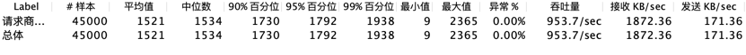
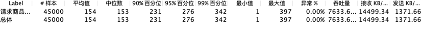
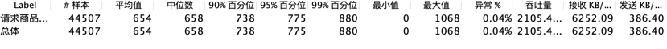
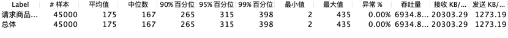
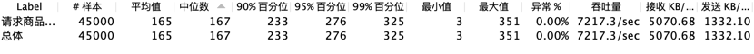
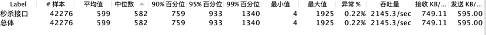
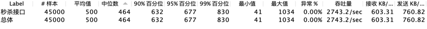
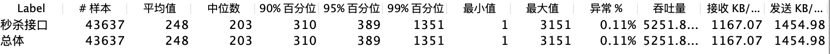
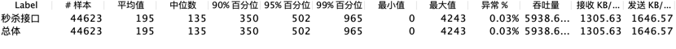

## 技术栈
SpringBoot + MyBatis + MySql + Redis + RabbitMQ + Thymeleaf

## 实现功能
1. 用户注册和登录
2. 展示商品列表
3. 展示商品详情
4. 秒杀和展示订单详情

### 一. 用户注册和登录
1. 用户通过手机号进行注册: 使用正则表达式校验手机号的合法性, 密码通过两次MD5加密后存入数据库.
2. 用户登录: 登录成功后, 为用户生成ticket, 并以ticket为键将用户信息存入redis, ticket随Cookie返回到客户端, 实现记录用户登录状态的功能.

### 二. 展示商品列表
1. 通过redis实现商品列表的页面缓存, 以加快响应速度, 提升系统吞吐量

### 三. 展示商品详情
1. 通过redis实现商品的对象缓存, 以加快响应速度, 提升系统吞吐量
2. 使用页面静态化技术和静态资源缓存提升页面访问速度

### 四. 秒杀和展示订单详情
1. 利用redis的decrement操作的原子性实现预减库存: 将商品库存缓存到redis中, 同时通过内存标记商品库存是否不足, 以解决超卖问题, 同时提高系统吞吐量
2. redis缓存订单, 防止同一用户多次下单
3. 使用RabbitMQ缓存秒杀请求, 降低系统的耦合度, 同时实现流量削峰, 提高系统的稳定性
4. 通过页面静态化技术提高秒杀后展示订单详情的速度, 提高用户体验

## 优化效果
### 请求商品列表:
1. 未优化:  

2. 页面缓存:  

### 请求商品详情
1. 未优化: toDetail1  

2. 页面缓存: toDetail2  

3. 对象缓存 + 页面静态化: toDetail3  

### 秒杀接口:
1. 未优化:  

2. 页面静态化 + redis缓存秒杀订单  

3. 添加: redis预减库存  

4. 添加: 内存标记库存是否为0  

